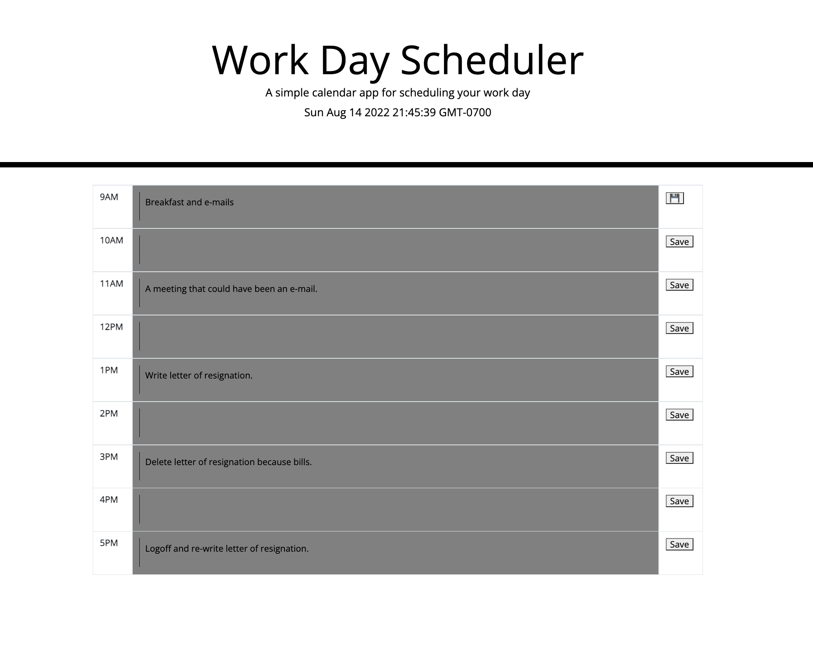

# Work Day Scheduler Starter Code
For this work day scheduler, we've implemented moment.js to allow the user to view the current time and other hours in relation to the current hour via color coding. 
Grey is for the past, red for current hour, and green for future hours.
You are able to input to-do items in the text areas of each row and view them even after a reload.
Make sure to press the save button at the end of each row to ensure your item is saved properly.
https://shadin-a.github.io/module5-work-calendar/

